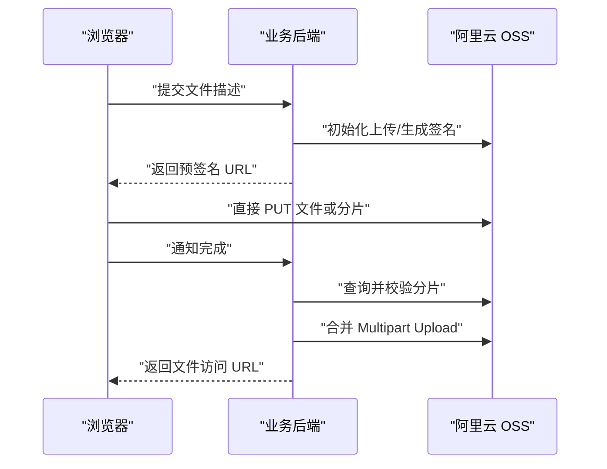

# AliOSS 前端预签名上传

`AliOSS` 用于在浏览器中通过后端生成的预签名 URL 直传阿里云 OSS，支持：

- 单文件 PUT 上传
- 上传进度监听
- `task.cancel()` 或外部 `AbortSignal` 取消
- 分片切割和受限并发上传
- 多分片总体进度聚合
- 任务内暂停、继续和跨页面断点续传
- 上传完成后通知后端校验、合并
- 上传失败或取消后通知后端清理 Multipart Upload

实现位于 `index.ts`，公共类型位于 `types.ts`。推荐从 `@/utils/AliOSS` 直接导入，避免业务页面加载其他无关工具。

阿里云文档：[使用预签名 URL 上传文件](https://help.aliyun.com/zh/oss/user-guide/upload-files-using-presigned-urls)

## 前端快速客户端

同一个项目通常只需要配置一次后端适配器：

```ts
import { createAliOSSUploader } from '@/utils/AliOSS'

export const uploader = createAliOSSUploader({
	createSimpleSignature: ({ signal, ...file }) => uploadApi.createSimpleSignature(file, signal),
	prepareMultipart: ({ signal, ...file }) => uploadApi.prepareMultipart(file, signal),
	listMultipartParts: ({ uploadId, signal }) => uploadApi.listParts({ uploadId }, signal),
	signMultipartParts: ({ uploadId, partNumbers, signal }) => uploadApi.signParts({ uploadId, partNumbers }, signal),
	completeMultipart: ({ uploadId, signal }) => uploadApi.complete({ uploadId }, signal),
	abortMultipart: ({ uploadId }) => uploadApi.abort({ uploadId })
})
```

适配器方法应返回已经从项目 `{ code, msg, data }` 响应中解包的 `data`。配置完成后，业务页面无需重复编排后端回调：

```ts
const simpleTask = uploader.simpleUpload(file, {
	onProgress: ({ percent }) => console.log(percent)
})

const multipartTask = uploader.multipartUpload(file, {
	partSize: 5 * 1024 ** 2,
	concurrency: 3,
	onProgress: ({ percent }) => console.log(percent)
})

const resumableTask = uploader.resumableUpload(file, {
	resumeKey: fileHash,
	partSize: 5 * 1024 ** 2,
	concurrency: 3
})

resumableTask.pause()
resumableTask.resume()
resumableTask.cancel('永久取消并清理')
```

`simpleUpload` 自动申请签名；`multipartUpload` 自动执行初始化、全部分片签名、上传、合并及失败清理；`resumableUpload` 自动查询 OSS 已有分片，只签名并上传缺失部分。

## 工作流程

简单上传：

1. 前端将文件名、大小和需要签名的 Header 发送给业务后端。
2. 后端使用 AccessKey 生成 PUT 预签名 URL。
3. 前端使用 `AliOSS.simpleUpload` 将文件二进制直接 PUT 到 OSS。

分片上传：

1. 前端将文件名、文件大小和期望的 `partSize` 发送给业务后端。
2. 后端调用 `InitiateMultipartUpload`，为每个 `partNumber` 生成 PUT 预签名 URL。
3. 前端使用 `AliOSS.multipartUpload` 按 `partNumber` 切割并并发上传文件。
4. 全部分片上传成功后，`complete` 回调通知后端校验分片并调用 `CompleteMultipartUpload`。
5. 上传失败或取消时，`abort` 回调通知后端调用 `AbortMultipartUpload` 清理残留分片。

AccessKey 和 AccessKeySecret 只能保存在后端，不能返回给浏览器。

## 项目内置演示

登录后访问 `/oss-upload-demo`，可以分别验证普通上传、分片上传和断点续传。演示页面调用以下后端接口：

| 方法   | 路径                                        | 用途                                       |
| ------ | ------------------------------------------- | ------------------------------------------ |
| `POST` | `/api/v1/ossUploadDemo/simple/sign`         | 生成普通 PUT 上传签名                      |
| `POST` | `/api/v1/ossUploadDemo/multipart/prepare`   | 创建或按 `resumeKey` 恢复 Multipart Upload |
| `POST` | `/api/v1/ossUploadDemo/multipart/listParts` | 从 OSS 查询已上传分片                      |
| `POST` | `/api/v1/ossUploadDemo/multipart/signParts` | 为指定缺失分片生成新签名                   |
| `POST` | `/api/v1/ossUploadDemo/multipart/complete`  | 后端校验分片并完成合并                     |
| `POST` | `/api/v1/ossUploadDemo/multipart/abort`     | 永久取消并清理 Multipart Upload            |

演示服务按当前登录用户隔离上传会话，但只将会话保存在 Node.js 进程内；服务重启后无法恢复。生产环境应将 `uploadId`、Object Name、文件描述、`partSize`、`resumeKey` 和用户归属持久化到数据库或缓存，并清理长期未完成的上传。

## 后端返回数据约定

工具不绑定项目的具体 API 路径。建议简单上传接口返回：

```ts
interface SimpleUploadSignature {
	url: string
	/** 后端签名时指定的 Header；未指定时可省略 */
	headers?: Record<string, string>
}
```

建议分片初始化接口返回：

```ts
interface MultipartUploadInitResult {
	uploadId: string
	partSize: number
	parts: Array<{
		partNumber: number
		url: string
		/** 当前分片签名时指定的 Header */
		headers?: Record<string, string>
	}>
}
```

`partNumber` 必须从 1 开始连续排列，URL 中的 `partNumber` 必须与数据项一致。`partSize` 必须与后端计算分片数量、生成 URL 时使用的值完全相同。

## 简单上传

```ts
import { AliOSS, AliOSSUploadError } from '@/utils/AliOSS'

const signature = await getSimpleUploadSignature({
	filename: file.name,
	fileSize: file.size,
	contentType: file.type
})

const task = AliOSS.simpleUpload(file, signature.url, {
	headers: signature.headers,
	timeout: 10 * 60 * 1000,
	onProgress: ({ loaded, total, percent }) => {
		console.log(`${loaded}/${total}`, `${percent.toFixed(2)}%`)
	}
})

try {
	const response = await task
	console.log(response.status, response.etag)
} catch (error) {
	if (AliOSS.isCanceled(error)) {
		console.log('上传已取消')
	} else if (error instanceof AliOSSUploadError) {
		console.error(error.status, error.responseBody)
	} else {
		throw error
	}
}
```

预签名上传的请求体是 `File` 或 `Blob` 二进制，不能使用 `FormData`。

## 取消上传

任务可以直接取消：

```ts
const task = AliOSS.simpleUpload(file, signature.url)

cancelButton.addEventListener('click', () => {
	task.cancel('用户取消上传')
})

await task
```

也可以使用已有的 `AbortSignal`：

```ts
const controller = new AbortController()
const task = AliOSS.simpleUpload(file, signature.url, {
	signal: controller.signal
})

controller.abort()
await task
```

Vue 组件卸载时应取消仍在执行的任务：

```ts
const task = AliOSS.simpleUpload(file, signature.url)

onBeforeUnmount(() => task.cancel('组件已卸载'))
```

`AliOSSUploadTask` 同时提供：

- `promise`：原始 Promise
- `signal`：任务内部的 `AbortSignal`
- `cancel(reason?)`：取消上传
- `then`、`catch`、`finally`：Promise 链式调用

因此既可以 `await task`，也可以 `await task.promise`。

## 分片上传

```ts
import { AliOSS } from '@/utils/AliOSS'

const initResult = await initMultipartUpload({
	filename: file.name,
	fileSize: file.size,
	partSize: 5 * 1024 * 1024
})

const task = AliOSS.multipartUpload(file, initResult.parts, {
	uploadId: initResult.uploadId,
	partSize: initResult.partSize,
	concurrency: 3,
	timeout: 10 * 60 * 1000,
	onProgress: ({ percent, partNumber, partLoaded, partTotal }) => {
		console.log(`总体 ${percent.toFixed(2)}%`)
		console.log(`分片 ${partNumber}: ${partLoaded}/${partTotal}`)
	},
	onPartComplete: ({ partNumber, etag }) => {
		console.log(`分片 ${partNumber} 上传完成`, etag)
	},
	complete: ({ uploadId, parts, signal }) => {
		return completeMultipartUpload(
			{
				uploadId,
				parts: parts.map(({ partNumber, etag, size }) => ({ partNumber, etag, size }))
			},
			signal
		)
	},
	abort: ({ uploadId, error }) => {
		return abortMultipartUpload({ uploadId, reason: String(error) })
	}
})

const { parts, completeResult } = await task
console.log(parts, completeResult)
```

`complete` 只会在全部 OSS PUT 请求成功后执行。任一分片上传失败、`complete` 失败或任务取消时，会中止其他在途分片并执行 `abort`。

建议后端使用保存的 `uploadId` 调用 OSS `ListParts` 校验实际已上传的分片，再调用 `CompleteMultipartUpload`；不要只信任前端传回的分片信息。

空文件不能使用分片上传，请改用 `simpleUpload`。

## 断点续传

`AliOSS.resumableUpload` 通过一个后端适配器完成断点续传。工具只规定触发方法的输入和输出，不限制 API 地址、请求库、数据库或后端语言。

适配器包含以下方法：

| 方法        | 触发时机                   | 用途                                                            |
| ----------- | -------------------------- | --------------------------------------------------------------- |
| `prepare`   | 首次启动任务               | 创建新 Multipart Upload，或根据 `resumeKey` 返回已有 `uploadId` |
| `listParts` | 启动、恢复、上传完成后     | 查询 OSS 中真实存在的分片                                       |
| `signParts` | 确认缺失分片后             | 只为缺失分片生成新的预签名 URL                                  |
| `complete`  | 所有分片校验完整后         | 后端再次校验并合并文件                                          |
| `abort`     | 用户明确调用 `cancel()` 后 | 清理 OSS Multipart Upload；可选                                 |

### 后端适配器示例

```ts
import type { AliOSSResumableUploadHandler } from '@/utils/AliOSS'

interface CompleteResult {
	objectName: string
	url: string
}

const handler: AliOSSResumableUploadHandler<CompleteResult> = {
	async prepare({ fileInfo, resumeKey, requestedPartSize, signal }) {
		// 只向后端发送文件描述，不发送 file 二进制。
		const result = await uploadApi.prepare(
			{
				resumeKey,
				filename: fileInfo.name,
				fileSize: fileInfo.size,
				contentType: fileInfo.type,
				lastModified: fileInfo.lastModified,
				partSize: requestedPartSize
			},
			{ signal }
		)

		return {
			uploadId: result.uploadId,
			partSize: result.partSize
		}
	},

	async listParts({ uploadId, signal }) {
		const result = await uploadApi.listParts({ uploadId }, { signal })
		return result.parts.map((part) => ({
			partNumber: part.partNumber,
			size: part.size,
			etag: part.etag
		}))
	},

	async signParts({ uploadId, partNumbers, signal }) {
		const result = await uploadApi.signParts({ uploadId, partNumbers }, { signal })
		return result.parts
	},

	async complete({ uploadId, parts, signal }) {
		return uploadApi.complete(
			{
				uploadId,
				parts: parts.map(({ partNumber, etag, size }) => ({ partNumber, etag, size }))
			},
			{ signal }
		)
	},

	async abort({ uploadId, resumeKey }) {
		await uploadApi.abort({ uploadId, resumeKey })
	}
}
```

上面的 `uploadApi` 只是业务 API 占位符。使用 Axios、Fetch 或项目的 `request` 封装都可以，只要适配器最终返回规定的数据结构。

### 创建续传任务

```ts
import { AliOSS } from '@/utils/AliOSS'

const task = AliOSS.resumableUpload(file, handler, {
	// 推荐使用后端文件 ID 或完整文件 Hash。相同文件重新选择后应得到相同 resumeKey。
	resumeKey: fileHash,
	partSize: 5 * 1024 * 1024,
	concurrency: 3,
	onStateChange: (state) => {
		console.log('上传状态:', state)
	},
	onProgress: ({ loaded, total, percent }) => {
		console.log(`${loaded}/${total}`, `${percent.toFixed(2)}%`)
	},
	onPartComplete: ({ partNumber, source }) => {
		console.log(`本轮完成分片 ${partNumber}`, source)
	}
})

const result = await task
console.log(result.uploadId, result.parts, result.completeResult)
```

任务状态包括：

```ts
type AliOSSResumableUploadState =
	'preparing' | 'uploading' | 'paused' | 'completing' | 'completed' | 'canceled' | 'failed'
```

### 暂停与继续

```ts
task.pause()

// 已完成分片保留在 OSS；继续时重新调用 listParts 和 signParts。
task.resume()
```

`pause()` 支持准备和上传阶段。后端已经进入合并阶段时不会暂停，避免重复提交不具备幂等性的合并请求；此时如需停止应调用 `cancel()`。

暂停不会触发 `handler.abort`。本轮未完成的 PUT 会被中止，恢复后会重新查询 OSS，并重新上传缺失或大小不正确的分片。

### 页面刷新后继续

页面刷新会销毁 JavaScript 任务，但 OSS 中已完成的分片和后端会话仍然存在。重新选择同一文件后，再用相同 `resumeKey` 创建任务即可：

```ts
const resumedTask = AliOSS.resumableUpload(file, handler, {
	resumeKey: savedFileHash
})

await resumedTask
```

后端的 `prepare` 应根据 `resumeKey` 和当前用户查找未完成会话并返回原来的 `uploadId`。之后工具会调用 `listParts`，跳过大小正确的已有分片，仅通过 `signParts` 请求剩余 URL。

若不传 `resumeKey`，后端仍可根据自己的业务上下文匹配会话，但工具不会使用不可靠的“文件名 + 大小”自动推断文件身份。

### 失败与永久取消

普通网络错误、URL 过期或页面关闭不会触发 `handler.abort`，因此后端和 OSS 会话会保留，之后可以重新创建任务续传。工具不会自动无限重试；业务可以提示用户重试，重新创建任务时 `signParts` 会为缺失分片返回新 URL。

只有用户明确永久取消时才清理会话：

```ts
task.cancel('用户删除上传任务')
```

调用 `cancel()` 后会中止全部在途请求，并触发 `handler.abort`。后端应调用 OSS `AbortMultipartUpload`，同时删除自己的会话记录。

### 已上传分片校验

`listParts` 返回的数据是续传依据：

```ts
interface AliOSSExistingPart {
	partNumber: number
	size: number
	etag?: string
}
```

工具会检查分片编号和大小。大小与当前 `partSize` 不匹配的分片不会被复用，而会加入缺失列表并用相同 `partNumber` 重新上传。

`complete` 调用前会再次触发 `listParts`。只有全部分片都存在且大小正确时才允许合并。后端仍应独立调用 OSS `ListParts` 做最终校验，不应仅信任前端传入的数据。

## 分片上传选项

| 选项             | 默认值      | 说明                                                  |
| ---------------- | ----------- | ----------------------------------------------------- |
| `uploadId`       | `undefined` | 后端初始化 Multipart Upload 返回的 ID，会原样传给回调 |
| `partSize`       | `5 MiB`     | 必须与后端生成分片 URL 时使用的大小一致               |
| `concurrency`    | `3`         | 同时执行的 PUT 请求数                                 |
| `headers`        | `{}`        | 所有分片共用且参与签名的 Header                       |
| `signal`         | `undefined` | 外部取消信号                                          |
| `timeout`        | `0`         | 每个 PUT 请求的超时时间，0 表示不限制                 |
| `onProgress`     | `undefined` | 总体及当前分片进度回调                                |
| `onPartComplete` | `undefined` | 单个分片上传完成回调                                  |
| `complete`       | `undefined` | 全部分片成功后的后端合并回调                          |
| `abort`          | `undefined` | 失败或取消后的后端清理回调                            |

每个分片数据项也可以设置独立的 `headers`，同名 Header 会覆盖全局 `headers`。

## 签名 Header 与 Content-Type

后端生成预签名 URL 时指定的 Header，前端上传时必须携带完全相同的名称和值，否则 OSS 可能返回 403 签名不匹配。

```ts
const headers = {
	'Content-Type': file.type,
	'x-oss-storage-class': 'Standard'
}

const task = AliOSS.simpleUpload(file, signature.url, { headers })
```

注意：

- 不要手动设置 `Content-Length`，浏览器会根据 Blob 大小自动发送。
- 如果后端签名时未指定 `Content-Type`，前端也不要传入。工具会使用无 MIME 类型的 Blob 视图，避免浏览器根据 `file.type` 自动增加该 Header。
- 如果后端签名时指定了 `Content-Type`，必须通过 `headers` 传入完全相同的值。
- 预签名 URL 包含临时访问凭证，不应写入日志、监控参数或长期存储。

## OSS CORS 配置

浏览器从 Web 站点直传 OSS 前，需要为 Bucket 配置跨域规则：

- Allowed Origin：前端站点的实际 Origin
- Allowed Method：`PUT`
- Allowed Header：实际使用的签名 Header，例如 `Content-Type`、`x-oss-*`
- Expose Header：需要前端读取 ETag 时添加 `ETag`

若进度监听或自定义 Header 触发 `OPTIONS` 预检，预检请求也必须成功。出现“network or CORS”错误时，应在浏览器开发者工具中检查真实的 PUT/OPTIONS 状态和 OSS 响应。

后端若通过 `ListParts` 获取 ETag 并完成合并，前端可以不读取 ETag，此时无需依赖浏览器暴露该响应头。

## 错误处理

- HTTP 非 2xx：抛出 `AliOSSUploadError`，包含 `status` 和 `responseBody`。
- 网络或 CORS 错误：抛出没有 HTTP 状态码的 `AliOSSUploadError`。
- 取消：通常抛出 `AliOSSUploadCanceledError` 或名称为 `AbortError` 的错误，可用 `AliOSS.isCanceled` 判断。
- 上传失败且 `abort` 清理也失败：抛出 `AggregateError`，其中同时包含上传错误和清理错误。

普通 `multipartUpload` 不会持久化断点信息。需要断点续传时使用 `resumableUpload`，由后端保存或找回 `uploadId`，并通过适配器为剩余分片重新生成有效 URL。

## 安全建议

- AccessKey 仅保存在后端，浏览器只接收短时有效的预签名 URL。
- 使用尽可能短的签名有效期。
- Object Name 应由后端校验和约束，避免前端任意指定覆盖目标。
- 不允许覆盖时，使用唯一 Object Name、`x-oss-forbid-overwrite` 或 Bucket 策略。
- 生产环境使用 HTTPS，避免预签名 URL 在传输中泄露。

## 上传流程


